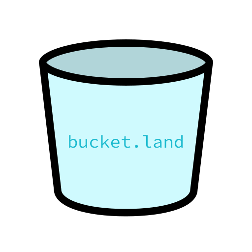

# bucketland

## Introduction

The concept of buckets in cloud storage is a powerful one.

Cloud Storage Buckets on platforms such as AWS S3, Google
Cloud Storage, DigitalOcean Spaces, and [MinIO][minio] have
a lot of powerful and useful features, including:

- **Buckets, Keys, and Objects** – A bucket contains *objects*
  which are like files. Each object has a unique *key* which
  is like a filename, only it isn't inside a folder, but is
  just a string. Objects can be listed as though they were
  in folders. To change the logical folder a group of
  objects are in, you rename each object, rather than the
  folder.
- **URLs** - A bucket has a specific and reliable URL, and
  so does an object inside a bucket. Usually the bucket URL
  is a subdomain, so it is easy to tell whether two objects
  are in different buckets or the same bucket. One bucket
  cannot be nested within another.
- **Access Control with Policies** – Bucket policies and/or
  IAM policies provide sophisticated permissions that can be applied to the entire bucket or a part of the bucket, identified by the key.
- **APIs** - APIs are provided for many programming
  languages and platforms with extensive documentation.
- **Versioning** – Buckets can provide version identifiers
  that support caching, and multiple versions can be saved
  and cleaned up automatically.
- **Notifications, Events, and FaaS Integration** – Whatever
  you call them, they're powerful. When an object is created,
  updated, or deleted, a record can be added to a queue, or
  a function can be called.
- **Pre-signed requests** – The original JWT. They aren't
  really [JSON Web Tokens][jwt] on most cloud providers, but
  are similar in that they can contain very granular
  permissions and an expiration time, and can be generated
  without storing a token in a database.
- **Web Hosting** - A website can be hosted from a bucket
  in various ways, such as directly from the bucket or
  through a CDN. The cloud storage service can send API
  calls to the CDN to expire cached objects when they are
  updated.
- **GUI** - Cloud Storage Providers have GUIs for
  administrating a bucket.
- **Command Line** - Command line tools make working with
  objects in cloud storage a lot like working with data in
  the local filesystem.
- **Tools** - A lot of first-party and third-party tools
  are available for working with cloud storage.

The aim of this project is to take the concept of buckets
further, by bringing the concept into other areas where
the abstraction makes sense, such as:

- **Origins in a web browser** – Each subdomain creates
  a different origin. [Vercel][vercel],
  [Let's Encrypt][letsenc], and others provide wildcard
  subdomains. You can easily get unlimited origins.
  Heroku and Netlify (as well as Vercel and Let's Encrypt)
  make it simple to map multiple subdomains to a site.
  Each origin has its own isolated cookies,
  LocalStorage, SessionStorage, and IndexedDB. They also
  have their own URL space, which can be mapped to
  another kind of bucket. This way, part of a site, such
  as the admin area, can have access to an API and data
  while the rest of the site does not.
- **Oauth and authentication** – Enterprises like Google
  have multiple subdomains, so that developers on one
  small project won't break the site-wide authentication
  system. When you log into google, it redirects
  to `accounts.google.com`. This behavior can be valuable
  for smaller organizations as well.
- **Repositories and branches in version control** –
  These are buckets of code. [BitBucket][bb] gets it!
- **Mapped API resources** – The data in an API could
  be mapped to paths in a bucket, like various things
  can be mapped on Fuse.

...as well as providing tools and answers for common
things involving buckets:

- **Sharing** – It should be easy to share things in a
  bucket without losing track of its source.
- **Synchronization** – It should be easy to synchronize
  objects between buckets. Part of this is about making
  use of tools that are already out there like
  [Rclone][rclone], as well as how to use git to find
  the difference between two buckets (md5sums and SHA-1's
  can help).
- **Slices** – In Rust and Go, you can take a slice of
  an array, and when you modify the slice, the updates
  show up in the main object. The idea here is to take
  a slice and put it into a separate bucket (such as
  a git repository) or a Markdown file's data.
- **Embed** – An origin can embed another origin
  inside of it through an iFrame. They are still
  different origins, but appear as one site. It is true
  that one bucket cannot be nested inside another
  bucket, but they should be nestable through some
  light virtualization.
- **Markdown code blocks** – A markdown code block can
  have a file embedded in it, using a code block. It
  should be useful to map it to an object in a bucket.
  Other things in Markdown like tables can also be
  mapped to files. This can support Literate Programming.
- **Deep linking** - Link to a path in a JSON object

## Project Ideas

- Treat data in a Cloud Object Storage bucket and in a
  git repository the same, in a fullstack web application
- Keep track of when data inside a bucket is accessed,
  inside of a web application's database
- Share viewing of data in a bucket, with and without
  using pre-signed requests from the storage provider
- Share editing data in a bucket, with and without using
  pre-signed requests from the storage provider
- Provide a simple editor for a list of files in a bucket
  that uses very little custom code, and where View Source
  works and the API can be quickly self hosted or its source
  inspected (I think Vercel does), so it can quickly be
  audited and trusted by a developer
- Synchronize data between a git repo and Cloud Storage
- Provide toast notifications when something changes in
  a bucket
- View data in a bucket, with deep linking
- Edit data in a bucket, with preview
- Edit data in two different buckets, side by side
- Override some of the data in a bucket with edits in
  LocalStorage
- Synchronize data between two browsers using Yjs,
  ShareDB or similar over WebSockets or WebRTC
- Synchronize data between iframes
- Synchronize data in a Markdown file with objects in
  a bucket - if the `README.md` file has `server.js`,
  place that `server.js` in the directory with the
  README
- Use Markdown plugins to replace blocks in Markdown with
  components created from the files extracted from the
  Markdown
- OAuth into two different accounts in the same window,
  each in a different iframe
- Browse two sites side by side at the same time with
  virtual history, using window.location.replace to keep
  the browser's back button from interfering
- Use postmessage to pass changes in color theme down to
  iframes (done on [notebook.resources.co][nrc])
- Encrypt OAuth tokens and keys so neither the browser
  nor the API has the full key - have the API or the
  browser store the key. When sending background requests,
  have the background request have part of the key, so the
  API can't use the OAuth token without the job queue
  initiating the request
- Load and save environment variables from the database
  in a Jamstack project, by using an encryption key stored
  in the environment, so they can be edited dynamically,
  and provide a way to migrate them to being stored in
  with the application host. This is probably better than
  using the host's API until more fine-grained access is
  available.

[jwt]: https://jwt.io/
[minio]: https://min.io/
[rclone]: https://rclone.org/
[vercel]: https://vercel.com/
[letsenc]: https://letsencrypt.org/
[oauth5]: https://www.youtube.com/watch?v=KT8ybowdyr0
[bb]: https://bitbucket.org/product/
[nrc]: https://notebook.resources.co/